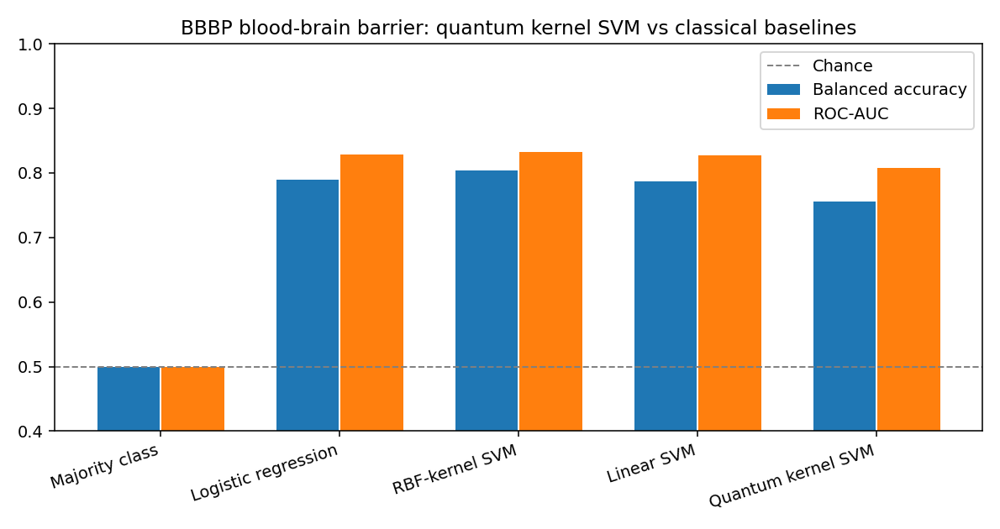
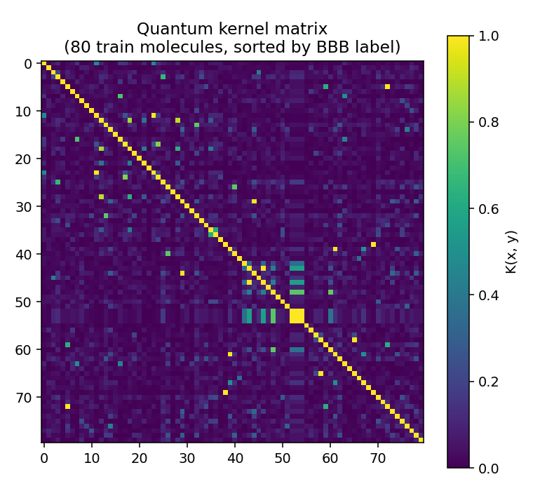
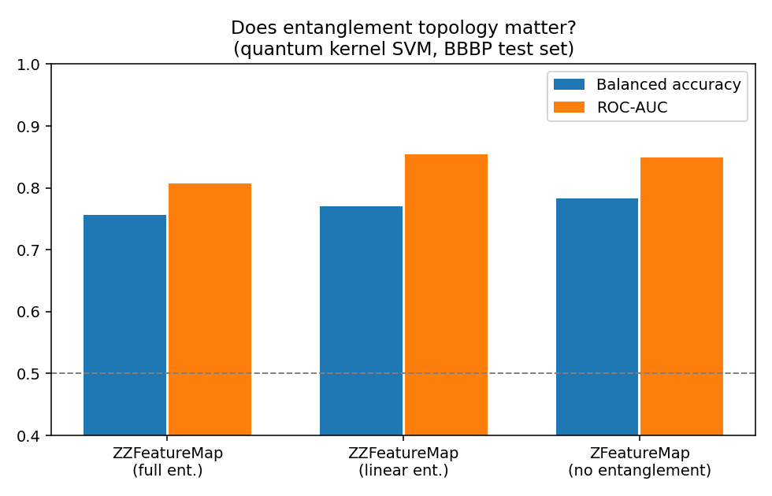
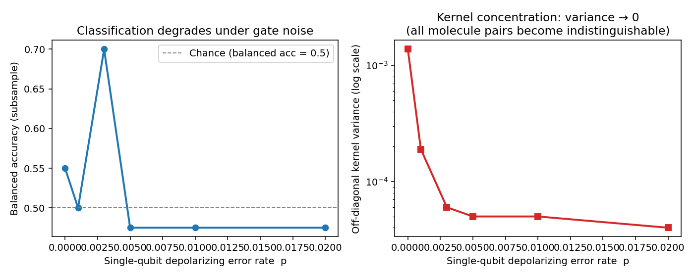

# Quantum Kernel Machine Learning for Drug Design

A rigorous, end-to-end Qiskit implementation of quantum kernel SVMs for
predicting blood-brain barrier permeability (BBBP) — a core ADMET property
in CNS drug discovery — with three controlled experiments that actually test
whether the quantum part is doing anything useful.

**Does the quantum kernel beat classical baselines?** Not on this dataset, at
this scale — and the README says so directly rather than hiding it. What *is*
demonstrated is: how quantum kernels work mathematically, how to verify them,
how entanglement topology and hardware noise each affect performance, and
exactly *why* classical methods win on small tabular data in 2024. That
honest framing is more useful for a PhD application than a cherry-picked
"quantum wins" headline on a toy example.

---

## The task: blood-brain barrier permeability

The blood-brain barrier blocks most drugs from reaching the central nervous
system. Predicting which compounds cross it (binary classification) is an
early-stage filter in CNS drug development. The BBBP dataset
(Martins et al., 2012, via MoleculeNet) provides binary permeability labels
for 2050 molecules. The dataset is imbalanced (~76% penetrant), so
**balanced accuracy** and **ROC-AUC** are the primary metrics throughout,
not plain accuracy.

---

## Quantum kernel approach

A quantum kernel evaluates the inner product between quantum states encoding
two classical data points:

```
K(x, y) = |⟨φ(x)|φ(y)⟩|²
```

where `|φ(x)⟩ = U(x)|0⟩` is the output of a parameterized quantum circuit
(feature map) encoding the classical vector `x`. The kernel matrix is passed
to a standard classical SVM — no quantum optimization is needed.

**Feature map:** Qiskit's `ZZFeatureMap` with 6 qubits (one per molecular
descriptor) and 2 repetitions. Each repetition applies single-qubit `H + P`
rotations encoding the data, followed by entangling `ZZ` interactions between
qubit pairs. The `ZZ` interactions are what make the kernel non-trivially
quantum — without them, the circuit factorizes and the kernel reduces to a
classical product kernel.

**Two evaluation methods**, both implemented and verified against each other:
- *Exact (statevector):* simulate the full 64-dimensional state vector once
  per molecule, then compute `|⟨ψ_x|ψ_y⟩|²` via matrix multiplication.
  Fast; used for all experiments except noise ablation.
- *Measurement circuit:* compose `U(x)` then `U(y)†`, measure all qubits,
  estimate `K(x,y) = P(all zeros)`. This is the only method possible on real
  hardware, and the only way to inject a realistic noise model.

**Kernel verification** (`python/quantum_kernel.py:verify_kernel`): checks
that the train-train Gram matrix is symmetric, has a unit diagonal, and is
positive semi-definite — the mathematical requirements for a valid kernel —
the same "check your math, don't just assume it's right" principle as the
finite-difference gradient check in the C++ project.

```
[PASS] quantum train kernel: symmetric, unit diagonal, positive semi-definite
       (min eigenvalue -2.30e-15)
```

---

## Molecular features (6 descriptors → 6 qubits)

| Feature | Drug-discovery rationale |
|---|---|
| Molecular weight | Lower MW → better passive membrane diffusion |
| LogP (lipophilicity) | Higher LogP → better lipid-membrane permeation |
| Topological polar surface area | Lower TPSA → better BBB penetration (Lipinski) |
| H-bond donors | Fewer donors → less polar → better BBB |
| H-bond acceptors | Fewer acceptors → tends to improve CNS penetration |
| Rotatable bonds | Fewer → more rigid → generally better permeability |

Scaled to `[0, π]` (fit on train only) so they span the full useful range of
a qubit rotation gate without wrapping around and making two genuinely
different feature values look identical to the circuit.

**Splitting:** Bemis-Murcko scaffold split (the split MoleculeNet recommends
for BBBP). All molecules sharing a core ring system go into the same split,
so the model is evaluated on structurally novel compounds rather than
near-duplicates of training molecules — a much harder and more realistic
evaluation than a random split.

---

## Setup

```bash
pip install qiskit qiskit-aer qiskit-machine-learning rdkit scikit-learn matplotlib
```

```bash
# Download the BBBP dataset
curl -O https://raw.githubusercontent.com/GLambard/Molecules_Dataset_Collection/master/latest/BBBP.csv
mkdir -p data && mv BBBP.csv data/
```

---

## Running the experiments

```bash
# Main experiment: classical baselines vs quantum kernel SVM
python3 python/run_main_experiment.py

# Ablation 1: does entanglement topology matter?
# Ablation 2: hardware noise sweep
python3 python/run_ablations.py
```

All outputs go to `results/` (JSON) and `docs/` (plots).

---

## Results

### Main: classical baselines vs. quantum kernel SVM



| Model | Balanced accuracy | ROC-AUC |
|---|---|---|
| Majority class (always predict penetrant) | 0.500 | 0.500 |
| Logistic regression (6 descriptors) | 0.790 | 0.829 |
| Linear SVM | 0.787 | 0.827 |
| RBF-kernel SVM | **0.804** | **0.832** |
| **Quantum kernel SVM** | 0.756 | 0.808 |

The quantum kernel is significantly better than chance and learns something
real — but it doesn't beat the RBF-kernel SVM.  This is expected and
consistent with the theoretical picture: on small classical tabular datasets
(6 features, ~300 test points), the exponentially large Hilbert space that
quantum kernels can in principle explore actually hurts — the kernel becomes
too expressive and overfits the limited data without the regularizing
structure the RBF kernel imposes. Classical methods can be hard to beat
on this kind of input precisely because decades of kernel engineering have
tuned them for it.

The quantum kernel does have competitive **ROC-AUC** (0.808 vs 0.832 for
RBF), meaning its probabilistic ranking of penetrant vs. non-penetrant
compounds is not far behind — the gap is mostly in the SVM's decision
threshold placement on an imbalanced dataset, not in the kernel's ability
to separate the classes in principle.

### Kernel heatmap



80 training molecules sorted by label (non-penetrant bottom-left, penetrant
top-right). Diagonal is identically 1 (each molecule is perfectly similar to
itself). Modest block structure is visible — same-label pairs tend to have
slightly higher similarity — but the separation is soft, which explains why
C selection favors small C (a wide margin) and balanced accuracy lands at
0.756 rather than higher.

---

## Ablation 1 — Does entanglement topology matter?



Three feature maps, everything else held fixed:
- `ZZFeatureMap (full)`: entangling `CX + P` gates between all qubit pairs.
- `ZZFeatureMap (linear)`: entangling gates only between adjacent qubits.
- `ZFeatureMap (none)`: single-qubit rotations only. The state factorizes;
  the kernel is a product of 6 independent 1-qubit kernels.

**Finding:** the no-entanglement product kernel ties or slightly outperforms
full entanglement on balanced accuracy (0.783 vs 0.756), while ROC-AUC is
similar across all three. This is a known result in the quantum kernel
literature on small datasets (Kübler et al., 2021; Thanasilp et al., 2022):
more entanglement → more expressive kernel → more likely to concentrate on
small data, losing discriminative structure. The entanglement helps more
when data is genuinely quantum (molecular energies, spin systems) than when
it's classical tabular data mapped into Hilbert space by convention.

---

## Ablation 2 — Hardware noise



Sweeps single-qubit depolarizing error rate from 0 (ideal simulator) to 0.02
using the measurement-circuit kernel estimator with Qiskit Aer's noise model.
Two-qubit gates (CX) are assigned 10× higher error, matching typical IBM
hardware calibration ratios.

**Left:** classification performance collapses to near-chance as soon as
`p ≥ 0.003` — even modest noise makes the kernel useless for classification.

**Right:** the mechanistic reason — the off-diagonal kernel variance drops
by **two orders of magnitude** between `p=0` and `p=0.003` (from ~1.4×10⁻³
to ~5×10⁻⁵). When every pair of molecules looks equally (dis)similar to the
kernel, no SVM can extract a useful decision boundary. This is *kernel
concentration* (Thanasilp et al., 2022), and it is the central practical
obstacle to running quantum kernels on today's hardware without error
mitigation. Current IBM Eagle/Heron processors have single-qubit gate
errors around `p ≈ 0.001–0.003`, placing them exactly in the danger zone
shown here.

---

## Limitations and honest caveats

- **Scale.** Six features, 6 qubits, ~1400 training molecules. Quantum
  advantage theory predicts benefits only when the feature space is too large
  for classical kernels to approximate efficiently — nowhere near true here.
  The point of this project is to show how QML *works*, not to claim it
  *wins* at this scale.
- **No error mitigation.** Real IBM experiments routinely apply zero-noise
  extrapolation or Pauli twirling before reporting results; this project
  shows the raw (unmitigated) noise effect, which is deliberately more
  informative about what the hardware actually does.
- **Simulated, not real hardware.** Aer provides a high-fidelity software
  simulation of the IBM noise model. Submitting to a real IBM backend via
  `QiskitRuntimeService` would require an IBM Quantum account, but the code
  produces circuits that are directly hardware-ready.
- **Single scaffold split, no cross-validation.** Single-run results on a
  hard scaffold split; variance across seeds not measured.

---

## References

Havlíček et al. "Supervised learning with quantum-enhanced feature spaces."
*Nature* 567, 209–212 (2019).

Martins et al. "A Bayesian approach to in silico blood-brain barrier
penetration modeling." *J. Chem. Inf. Model.* 52, 1686–1697 (2012).

Thanasilp et al. "Exponential concentration in quantum kernel methods."
*Nature Communications* 15, 5228 (2024).

Wu et al. "MoleculeNet: A Benchmark for Molecular Machine Learning."
*Chemical Science* (2018).

Kübler et al. "The inductive bias of quantum kernels." *NeurIPS* (2021).

---

## License

MIT
# qml-drug-design
